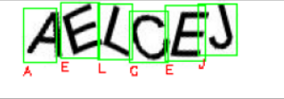
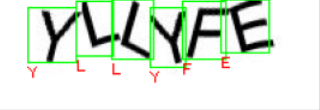
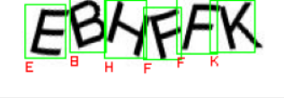
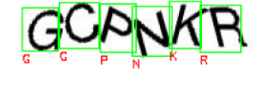
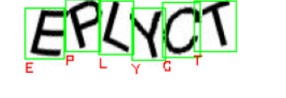

# Breaking Amazon CAPTCHA with Deep Learning

## What's it about?
Utilizing Keras/Tensorflow to create an end to end Deep Learning solution which will be able to perform object localization and classification for each letter of CAPTCHA image.  

 
In many guides and tutorials for breaking letter CAPTCHA-s I found solutions which relied on OpenCV contour finding to localize letters so a DL model can perform classification.
Such aproach often proved unreliable, as no matter how good the classification model is, it still depends solely on OpenCV's ability to find correct countours. 
Instead, I decided to replace that part of the process with a custom model which, by itself, will be able to localize letters on the image.

## Data used:
Data comes in two forms:
- .jpg images
- .xml files
1. *images* folder contains 150 images, that I gathered, splitted into 140 for training and 10 images which will be used to test object detection on. Each image is named according to text that is displayed on it.
2. Each image has its corresponding XML file which contains bounding box coordinates for each letter. CAPTCHA images were labeled by myself using [LabelImg](https://github.com/tzutalin/labelImg) image labeling tool.

## Deep Learning models and Object detection:
### Object detection here consists of two separate models - one for letter localization, other for letter classification:  
- Since the amount of letters on image is always 6, localization is done by using Convolutional Layers to extract features, and a 24 output Dense Layer
without activation function for regression of bounding box coordinates.
- After that, each letter's predicted bounding box is resized and passed into the Classification model, to determine its value.

 

**<b>Note</b>: This knowledge, <b>under no circumstances</b> should be used for nefarious or unethical reasons. This case study exists as a method to
demonstrate how to label a custom dataset and train deep learning models on top of it. I am not responsible for how this code is used - use this as an opportunity to learn!

